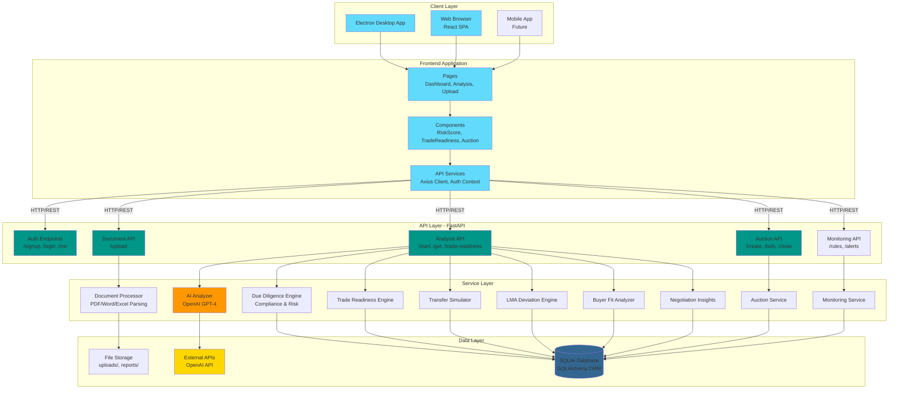
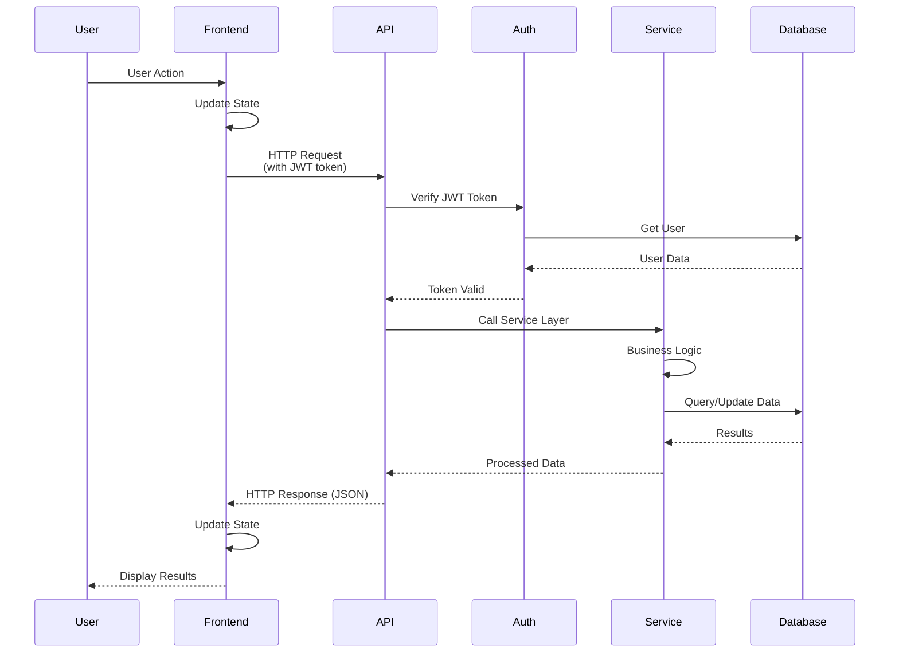
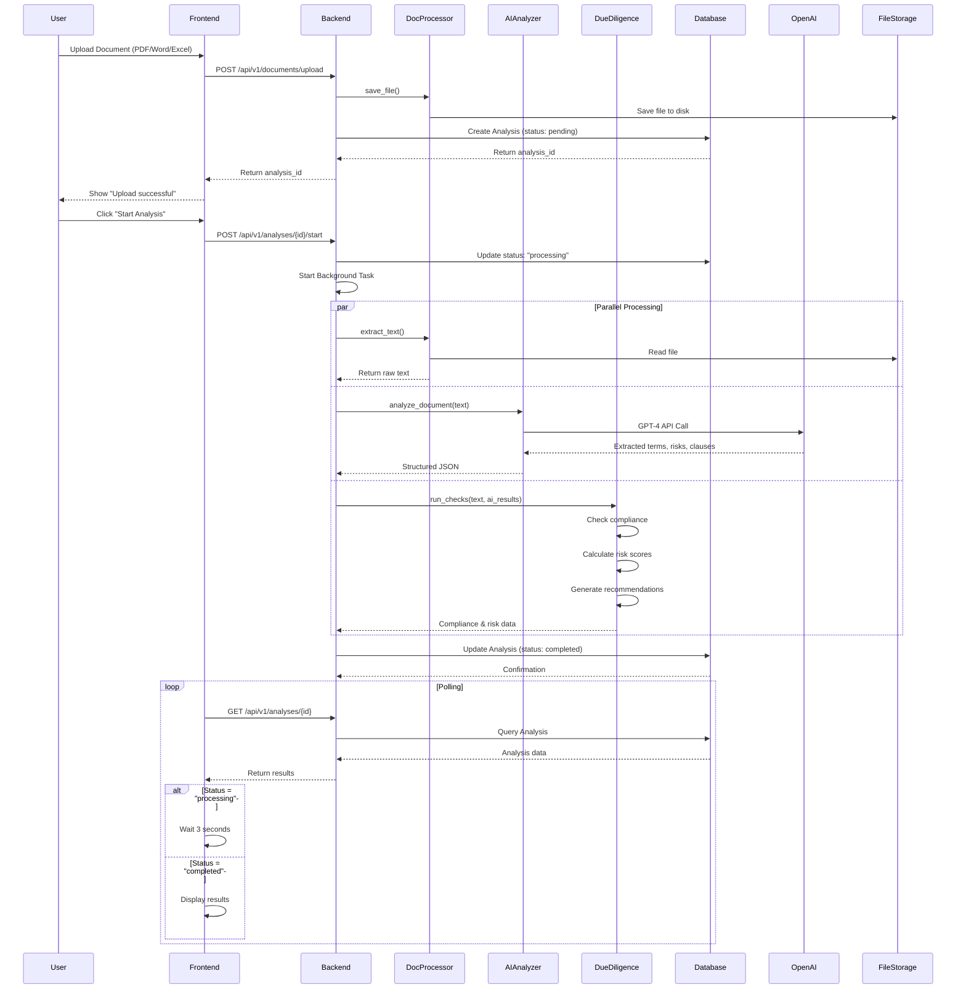
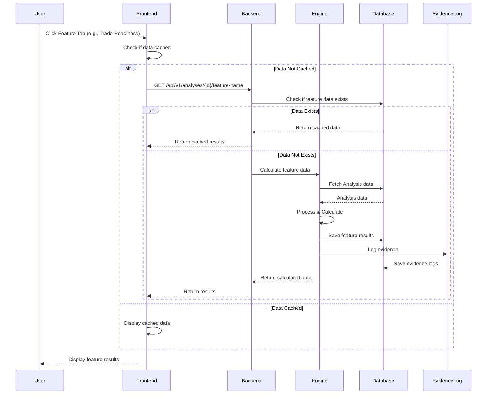
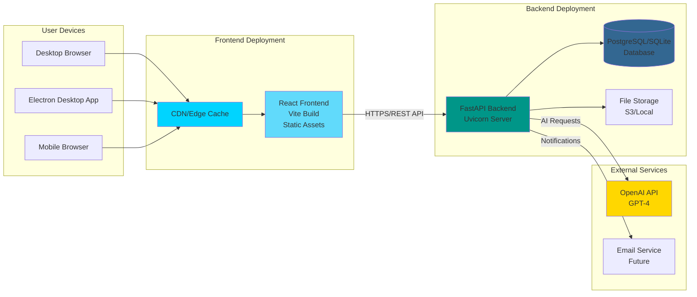
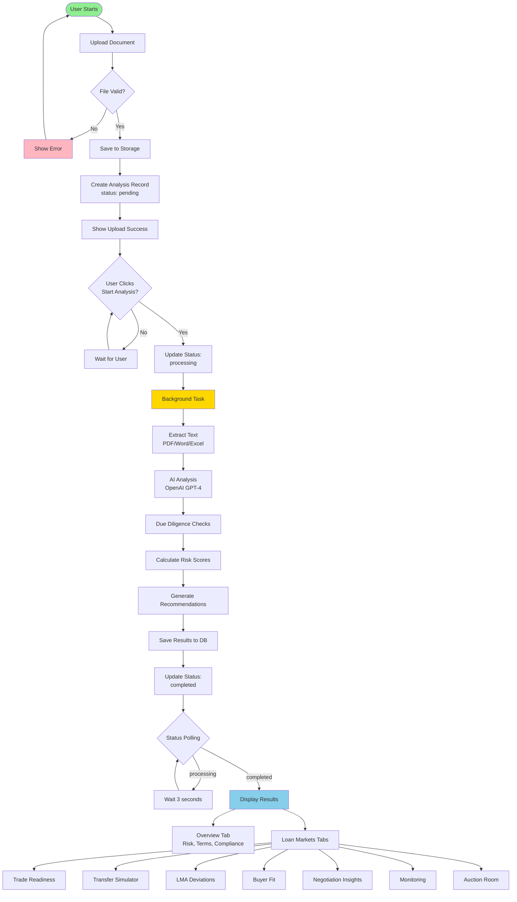
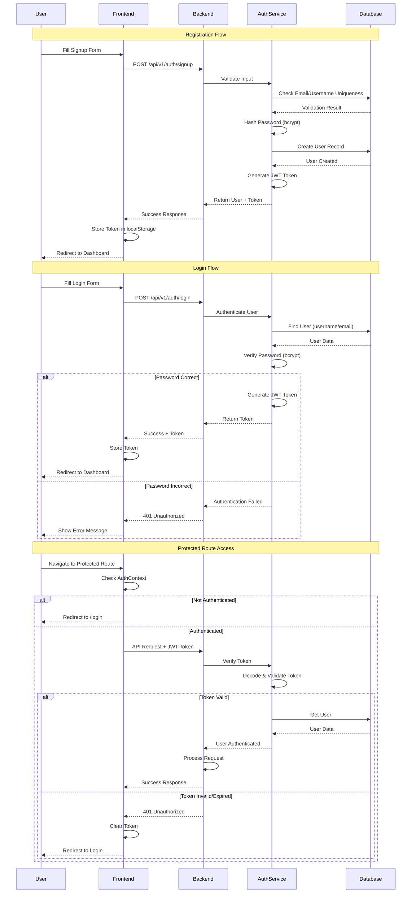
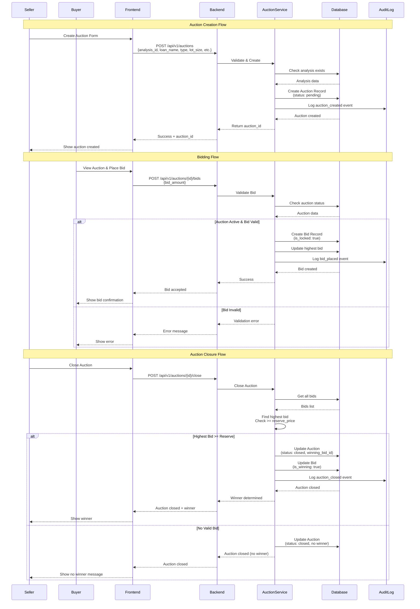

# CrystalTrade

**CrystalTrade** - Transparent Loan Trading Platform for the LMA Edge Hackathon.

CrystalTrade automates due diligence checks for secondary loan market transactions, bringing transparency and efficiency to loan trading.

## Overview

This desktop application automates and streamlines due diligence checks for secondary loan market transactions using AI/ML to analyze loan documents, assess risks, verify compliance, and generate comprehensive reports.

## Features

- **Document Upload & Processing**: Drag-and-drop interface for loan documents with automatic classification
- **AI-Powered Analysis**: Extracts key loan terms, identifies risks, and flags unusual clauses
- **Automated Due Diligence**: Checks transfer restrictions, consent requirements, financial covenants, and regulatory compliance
- **Risk Assessment**: Visual risk scoring with breakdown by category (credit, legal, operational)
- **Compliance Checklist**: Automated compliance verification against LMA standards
- **Report Generation**: Automated PDF report generation with executive summaries
- **Trade Readiness Scoring**: Assesses loan tradeability with explainable breakdown
- **Transfer Simulation**: Simulates assignment and participation pathways
- **LMA Deviation Detection**: Identifies deviations from LMA standard templates
- **Buyer Fit Analysis**: Matches loans to suitable buyer types (CLO, Bank, Distressed Fund)
- **Negotiation Insights**: Predicts negotiation points and suggests redlines
- **Post-Trade Monitoring**: Rule-based alerting for covenants and obligations
- **Auction Room**: English and sealed-bid auction functionality for loan trading

## Technology Stack

### Frontend
- Electron (desktop framework)
- React + TypeScript
- Tailwind CSS
- Recharts (data visualization)
- React Router DOM (routing)
- Axios (HTTP client)
- React Hot Toast (notifications)

### Backend
- Python FastAPI
- OpenAI GPT-4 (document analysis)
- LangChain (document processing)
- SQLite/PostgreSQL (data storage)
- SQLAlchemy (ORM)
- ReportLab (PDF generation)
- Pydantic (data validation)
- JWT (authentication)
- Bcrypt (password hashing)

## Architecture

### System Architecture Diagram



### Request Flow



## Project Structure

```
LMA-CrystalTrade/
├── backend/                          # FastAPI backend
│   ├── services/                     # Business logic
│   │   ├── ai_analyzer.py            # OpenAI GPT-4 analysis
│   │   ├── auction_service.py        # Auction management
│   │   ├── buyer_fit_analyzer.py     # Buyer matching
│   │   ├── document_processor.py    # Document parsing
│   │   ├── due_diligence_engine.py   # Compliance checks
│   │   ├── lma_deviation_engine.py   # LMA deviation detection
│   │   ├── monitoring_service.py     # Post-trade monitoring
│   │   ├── negotiation_insights.py   # Negotiation prediction
│   │   ├── report_generator.py       # PDF generation
│   │   ├── trade_readiness_engine.py # Trade readiness scoring
│   │   └── transfer_simulator.py    # Transfer pathways
│   ├── models.py                     # Database models
│   ├── main.py                       # FastAPI app
│   └── database.py                   # DB connection
├── src/                              # React frontend
│   ├── components/                   # Reusable components
│   ├── pages/                        # Page components
│   ├── services/                     # API client
│   └── contexts/                     # React contexts
├── electron/                         # Electron desktop app
└── package.json                      # Dependencies
```

## Data Models

### Core Models

- **Analysis**: Primary analysis results (risk scores, terms, compliance)
- **Document**: Uploaded document metadata
- **Report**: Generated PDF reports
- **User**: Authentication and user profiles

### Loan Markets Models

- **TradeReadiness**: Trade readiness scores and breakdowns
- **TransferSimulation**: Transfer pathway simulations
- **LMADeviation**: LMA template deviation records
- **BuyerFit**: Buyer type fit analysis
- **NegotiationInsight**: Negotiation predictions
- **MonitoringRule**: Post-trade monitoring rules
- **MonitoringAlert**: Generated alerts
- **Auction**: Auction records
- **Bid**: Bid records

### Supporting Models

- **EvidenceLog**: Evidence tracking for AI results
- **AuditEvent**: Audit trail
- **Deal**: Deal/transaction records

See `backend/models.py` for complete model definitions with fields and relationships.

## Data Flow Diagram

### Document Upload and Analysis Flow



### Loan Markets Feature Data Flow



## Entity Relationship Diagram

### Entity Relationship Diagram


## Deployment Architecture

### Deployment Architecture Diagram



## Workflow Diagram

### Document Analysis Workflow




### Authentication Flow



### Auction Workflow



## AI Modules Used

### Core AI Libraries

- **OpenAI** (`openai>=1.54.0`): GPT-4 Turbo for document analysis
- **LangChain** (`langchain>=0.3.0`): Document processing framework
  - `langchain-openai`: OpenAI integration
  - `langchain-text-splitters`: Text chunking (4000 chars, 200 overlap)
  - `langchain-core`: Core components
- **spaCy** (`spacy>=3.7.5`): NLP for entity recognition
- **scikit-learn** (`scikit-learn>=1.5.0`): ML algorithms
- **numpy** (`numpy>=1.26.0`): Numerical computations
- **chromadb** (`chromadb>=0.5.0`): Vector database for embeddings

### Document Processing

- **pdfplumber** (`pdfplumber>=0.11.0`): PDF text extraction
- **pypdf2** (`pypdf2>=3.0.1`): PDF fallback
- **python-docx** (`python-docx>=1.1.2`): Word processing
- **openpyxl** (`openpyxl>=3.1.5`): Excel processing
- **pytesseract** (`pytesseract>=0.3.13`): OCR
- **pillow** (`pillow>=11.0.0`): Image processing

### AI Services

- **AIAnalyzer**: GPT-4 document analysis
- **TradeReadinessEngine**: Rule-based scoring
- **LMADeviationEngine**: Template matching
- **BuyerFitAnalyzer**: Classification algorithms
- **NegotiationInsightsGenerator**: Pattern recognition

### AI Configuration

- **Model**: GPT-4 Turbo Preview
- **Temperature**: 0 (deterministic)
- **Chunk Size**: 4000 characters
- **Chunk Overlap**: 200 characters

## Setup Instructions

### Prerequisites
- Node.js 18+ and npm
- Python 3.10+
- OpenAI API key (optional, for AI features)

### Installation

1. **Install frontend dependencies:**
```bash
npm install
```

2. **Install backend dependencies:**
```bash
cd backend
pip install -r requirements.txt
```

3. **Set up environment variables:**
Create a `.env` file in the backend directory:
```
OPENAI_API_KEY=your_openai_api_key_here
DATABASE_URL=sqlite:///./crystal_trade.db
```

4. **Initialize database:**
```bash
cd backend
python -c "from database import init_db; init_db()"
```

### Running the Application

**Option 1: Docker (Recommended)**
```bash
# Start all services
docker-compose up -d

# Initialize database
docker-compose exec backend python -c "from database import init_db; init_db()"
```

Access:
- Frontend: http://localhost:3000
- Backend API: http://localhost:8000
- API Docs: http://localhost:8000/docs

See [DOCKER.md](DOCKER.md) for detailed Docker instructions.

**Option 2: Docker Development Mode (Hot Reload)**
```bash
./docker-dev.sh
```

This starts containers with hot-reload enabled - code changes are automatically reflected!

**Option 3: Local Development (No Docker)**
```bash
npm run dev
```

This will start:
- React dev server on http://localhost:5173
- FastAPI backend on http://localhost:8000
- Electron desktop app

**Build for production:**
```bash
npm run build
npm start
```

## API Endpoints

- `POST /api/v1/documents/upload` - Upload document
- `POST /api/v1/analyses/{id}/start` - Start analysis
- `GET /api/v1/analyses/{id}` - Get analysis results
- `GET /api/v1/dashboard/stats` - Get dashboard statistics
- `GET /api/v1/reports` - List reports
- `POST /api/v1/reports/generate` - Generate report

## Usage

1. **Upload Documents**: Navigate to the Upload page and drag-and-drop loan documents
2. **Start Analysis**: Click "Upload and Analyze" to begin AI-powered analysis
3. **View Results**: Once analysis completes, view detailed results including:
   - Risk scores and breakdown
   - Extracted loan terms
   - Compliance checklist
   - Recommendations
4. **Generate Reports**: Create PDF reports from completed analyses

## Commercial Viability

- **Target Users**: Loan traders, secondary market participants, due diligence teams
- **Value Proposition**: Reduces due diligence time from days to hours, cuts costs by 60-80%
- **Scalability**: Cloud-ready architecture, API-first design
- **Revenue Model**: Per-transaction pricing or subscription tiers

## License

MIT License

Copyright (c) 2024 CrystalTrade

Permission is hereby granted, free of charge, to any person obtaining a copy
of this software and associated documentation files (the "Software"), to deal
in the Software without restriction, including without limitation the rights
to use, copy, modify, merge, publish, distribute, sublicense, and/or sell
copies of the Software, and to permit persons to whom the Software is
furnished to do so, subject to the following conditions:

The above copyright notice and this permission notice shall be included in all
copies or substantial portions of the Software.

THE SOFTWARE IS PROVIDED "AS IS", WITHOUT WARRANTY OF ANY KIND, EXPRESS OR
IMPLIED, INCLUDING BUT NOT LIMITED TO THE WARRANTIES OF MERCHANTABILITY,
FITNESS FOR A PARTICULAR PURPOSE AND NONINFRINGEMENT. IN NO EVENT SHALL THE
AUTHORS OR COPYRIGHT HOLDERS BE LIABLE FOR ANY CLAIM, DAMAGES OR OTHER
LIABILITY, WHETHER IN AN ACTION OF CONTRACT, TORT OR OTHERWISE, ARISING FROM,
OUT OF OR IN CONNECTION WITH THE SOFTWARE OR THE USE OR OTHER DEALINGS IN THE
SOFTWARE.
